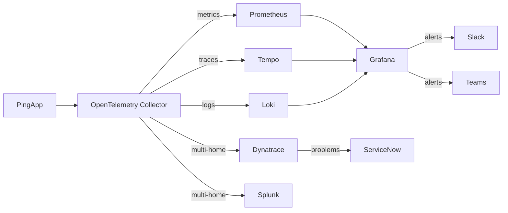
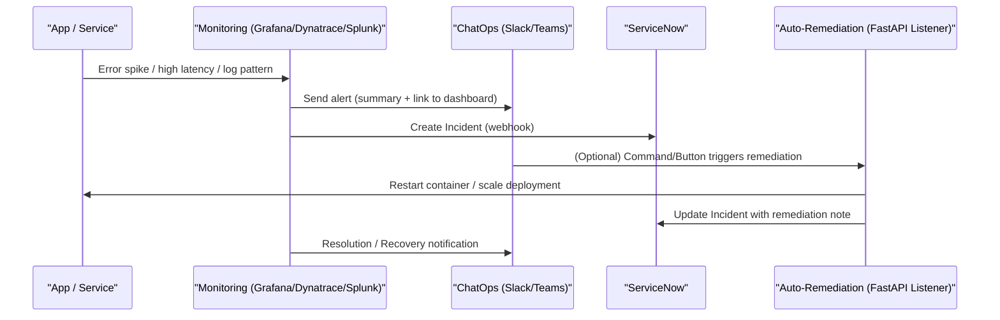

# AIOps Observability Portfolio

A hands-on AIOps lab built on a Synology NAS that combines open-source observability
(Grafana LGTM + OpenTelemetry) with enterprise platforms (Dynatrace, Splunk,
ServiceNow). It demonstrates modern SRE/AIOps practices, including monitoring,
alerting, incident automation, ChatOps integrations, Infrastructure as Code,
and anomaly detection.

The lab is designed to be modular, allowing governance, security, and automation
capabilities to be layered onto the observability foundation as the platform
evolves.

---

## 🚀 Capabilities
- **Open-Source Baseline**: Grafana, Prometheus/Mimir, Loki, Tempo, OpenTelemetry.
- **Enterprise Observability**: Dynatrace OneAgent, Splunk HEC ingestion, ServiceNow integration.
- **Alerting & Collaboration**: Slack + Teams + ServiceNow webhooks, optional Alertmanager.
- **Closed-Loop Automation**: FastAPI listener that creates incidents and performs remediation.
- **IaC**: Ansible for on-prem automation, Terraform for AWS Free Tier (S3, Lambda, CloudWatch).
- **Kubernetes (K3s)**: Workload deployment, Helm charts, OTel Collector DaemonSet.
- **Anomaly Detection**: Python container with Isolation Forest / Moving Average on metrics.
- **Data Governance (Extension)**: OpenMetadata for data discovery, ownership,
  classification, and lineage; Open Policy Agent (OPA) for policy-as-code
  enforcement, attribute-based access control (ABAC), and auditable
  data access decisions. Models enterprise governance patterns used
  by platforms such as Immuta.

- **Portfolio Polish**: Architecture docs, SLO policies, cost/ROI analysis, screenshots, training video.

---

## 📂 Project Structure
- **compose/** → Docker Compose stacks (baseline, enterprise, overrides)
- **grafana/** → Provisioning (dashboards, datasources, alerting rules)
- **prometheus/** → Prometheus configs, scrape rules, recording rules
- **loki/** → Loki + Promtail configs
- **tempo/** → Tempo values/config
- **otel/** → Collector pipelines (multi-homing to Dynatrace, Splunk, LGTM)
- **k8s/** → K3s manifests + Helm charts (pingapp, monitoring)
- **dynatrace/** → Policies, dashboards, alerting profiles
- **splunk/** → Docker setup, inputs.conf, saved searches
- **integrations/** → Slack, Teams, ServiceNow setup guides
- **alerting/** → Optional Alertmanager configs
- **scripts/** → Sample app, alert-listener (FastAPI), anomaly detector
- **ansible/** → Playbooks for lab automation
- **terraform/** → AWS IaC (Free Tier services, CloudWatch integration)
- **governance/** → Data governance lab (OpenMetadata, OPA, policy enforcement gateway)
- **docs/** → Architecture diagrams, runbooks, evaluation, ROI/SLO analysis
- **media/** → Screenshots, “Lunch & Learn” video

---

## 🔵 Full Enterprise Architecture

## 🔔 Incident Lifecycle Flow

